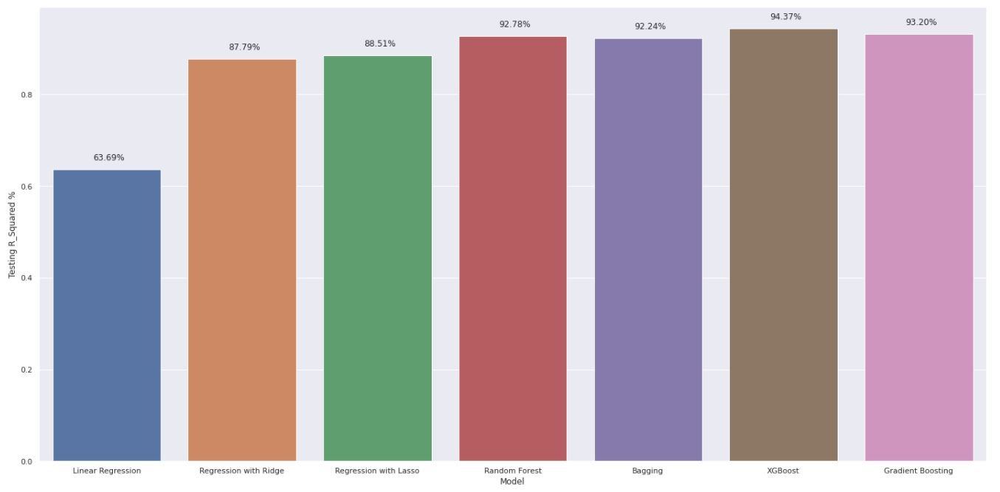

# Regression-Capstone

Building different regression models on Concrete Data to get best Concrete Compressive Strength

---

### **Description**

Compressive strength or compression strength is the capacity of a material or structure to withstand loads tending to reduce size, as opposed to tensile strength, which withstands loads tending to elongate.

Compressive strength is one of the most important engineering properties of concrete. It is a standard industrial practice that the concrete is classified based on grades. This grade is nothing but the Compressive Strength of the concrete cube or cylinder. Cube or Cylinder samples are usually tested under a compression testing machine to obtain the compressive strength of concrete. The test requisites differ country to country based on the design code.

---

### **Code Implementation**

After I did hypertuning for all models I implemented a class called **Regressor Class** So you can run last few cells directly insted of run all cells

| Methods in the class        |                                          Role                                           |
| --------------------------- | :-------------------------------------------------------------------------------------: |
| preprocessing               |                                  drop unneccesary data                                  |
| split_data                  |                             splitting data into train, tes                              |
| normalization               |                                     normalize data                                      |
| linear_regression           |                             fitting lnear regression model                              |
| polynomial_regression_ridge |                        polynomial regression with regularization                        |
| polynomial_regression_lasso |                        polynomial regression with regularization                        |
| random_forest               |                              apply random forest technique                              |
| xg_boosting                 |                             ensemble learning with xg_boost                             |
| gradient_boosting           |                        ensemble learning with gradient_boosting                         |
| calculate_r2_score          | calculating r2 score for each model and return if it's low, medium, high, and very high |

### **Regression Models**

I applied several ML models to see which yields better results and finishing with a Regression Model

1. Linear Regression
2. Regression + Regularization term (Ridge)
3. Regression + Regularization term (Lasso)
4. Random Forest
5. Bagging
6. XGBoost
7. Gradient Boosting

#### **Note:** I tested these models with R-Squared

## Why R-Squared?

R-squared is a goodness-of-fit measure for linear regression models. This statistic indicates the percentage of the variance in the dependent variable that the independent variables explain collectively. R-squared measures the strength of the relationship between your model and the dependent variable on a convenient 0 – 100% scale.

## Conclusion

- XGBoost Regression the highest R_squared for test data

- Linear Regression

---
